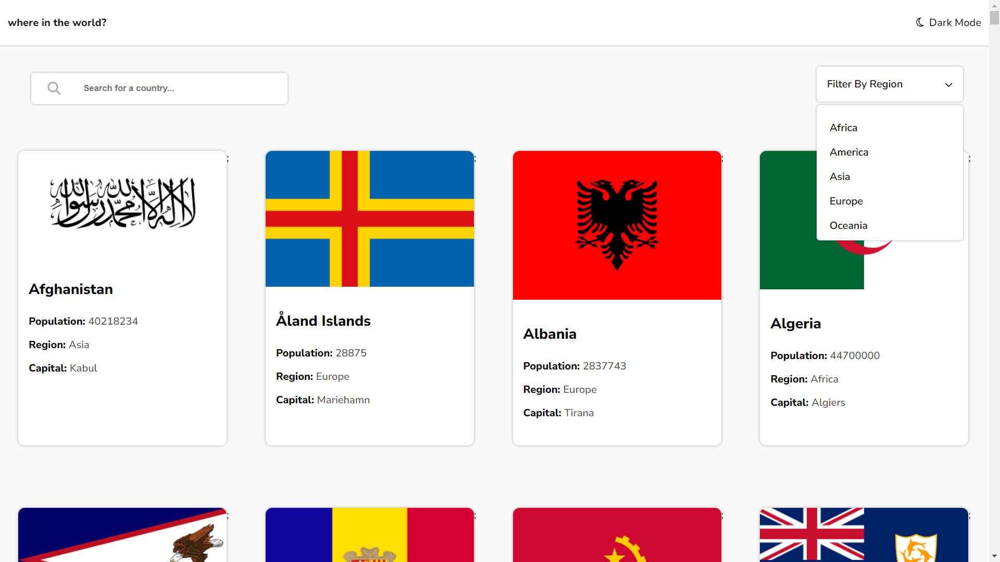
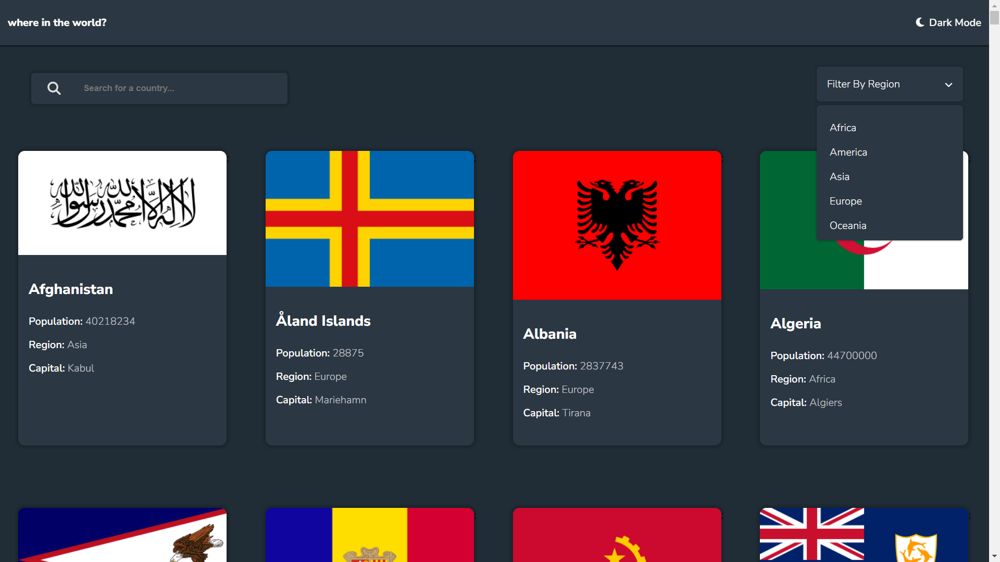

# Frontend Mentor - REST Countries API with color theme switcher solution

This is a solution to the [REST Countries API with color theme switcher challenge on Frontend Mentor](https://www.frontendmentor.io/challenges/rest-countries-api-with-color-theme-switcher-5cacc469fec04111f7b848ca). Frontend Mentor challenges help you improve your coding skills by building realistic projects.

## Table of contents

- [Frontend Mentor - REST Countries API with color theme switcher solution](#frontend-mentor---rest-countries-api-with-color-theme-switcher-solution)
  - [Table of contents](#table-of-contents)
  - [Overview](#overview)
    - [The challenge](#the-challenge)
    - [Screenshot](#screenshot)
    - [Links](#links)
  - [My process](#my-process)
    - [Built with](#built-with)
    - [What I learned](#what-i-learned)
    - [Continued development](#continued-development)
  - [Author](#author)
  - [Acknowledgments](#acknowledgments)

## Overview

### The challenge

Users should be able to:

- See all countries from the API on the homepage
- Search for a country using an `input` field
- Filter countries by region
- Click on a country to see more detailed information on a separate page
- Click through to the border countries on the detail page
- Toggle the color scheme between light and dark mode _(optional)_

### Screenshot





### Links

- Solution URL: [Add solution URL here](https://www.frontendmentor.io/solutions/rest-countries-api-using-react-redux-toolkit-and-sass-A7sJiNyQMJ)
- Live Site URL: [Add live site URL here](https://rest-countries-api-slyakodav.netlify.app/)


### Built with

- Semantic HTML5 markup
- CSS custom properties
- Flexbox
- CSS Grid
- Mobile-first workflow
- [React](https://reactjs.org/) - JS library
- [Redux/toolkit](https://redux-toolkit.js.org/)
- [Sass](https://sass-lang.com/)
- [Styled Components](https://styled-components.com/) - For styles

### What I learned

- I did learn how to use ReduxToolkit React and sass


```html
<div className="oneCountry">
  <div className="oneCountryImg">
    
  </div>
  <div className="OneCountryInformation">
    <h3 className="oneCountryName">{oneC.name}</h3>
    <div className="for-1440px-one">
      <div className="for-1440px-one-country">
        <div className="InfoText pd-t-1440px">
          Native Name : <span>{oneC.nativeName}</span>
        </div>
        <div className="InfoText">
          Population : <span>{oneC.population}</span>
        </div>
        <div className="InfoText">Region : <span>{oneC.region}</span></div>
        <div className="InfoText">
          Sub Region : <span>{oneC.subregion}</span>
        </div>
        <div className="InfoText">Capital : <span>{oneC.capital}</span></div>
      </div>
      <div className="for-1440px-one-country">
        <div className="InfoText pd-t">
          Top Level Domain : <span>{oneC.topLevelDomain}</span>
        </div>
        <div className="InfoText">
          Currencies : {oneC.currencies.map((e) => { return
          <span key="{e}">{e.name}</span>; })}
        </div>
        <div className="InfoText pd-b">
          Languages :
          <span>
            {oneC.languages.map((e) => { return
            <p key="{e.name}">{e.name}</p>
            ; })}
          </span>
        </div>
      </div>
    </div>
    <div className="border">
      <div className="borderText">Border Countries:</div>
      <div className="gridIt">
        {countries[0].borders ? ( countries[0].borders.map((e) => (
        <div key="{e}" className="borderCountry">{e}</div>
        )) ) : (
        <div className="borderCountry noOne">no country</div>
        )}
      </div>
    </div>
  </div>
</div>
```

```css
@media screen and (min-width: 700px) {
  .countries-main-page {
    display: grid;
    grid-template-columns: 1fr 1fr;
  }
}
@media screen and (min-width: 1020px) {
  .countries-main-page {
    display: grid;
    grid-template-columns: 1fr 1fr 1fr;
  }
}
@media screen and (min-width: 1300px) {
  .countries-main-page {
    display: grid;
    grid-template-columns: 1fr 1fr 1fr 1fr;
  }
  .country-container {
  }
  .oneCountry {
    display: flex !important;
    gap: 20%;
  }
  .countryImgInside {
    width: 175%;
  }
  .for-1440px-one {
    gap: 2rem;
    display: flex;
    .pd-t {
      padding-top: 0 !important;
    }
  }
  .gridIt {
    gap: 1rem;
    gap: 2rem !important;
    grid-template-columns: 1fr 1fr 1fr 1fr 1fr !important;
    position: relative;
    bottom: 0.1rem;
  }
  .borderCountry {
    height: fit-content;
  }
  .OneCountryInformation {
    padding-top: 3rem;
  }
  .border {
    padding-top: 3rem;
    display: flex;
    gap: 1rem;
  }
  .pd-t-1440px {
    padding-top: 0 !important;
  }
  .for-1440px {
    padding: 0 1.5rem;
    width: 100%;
    .search-bar {
      width: 30%;
    }
    .filter {
      padding-top: 4rem;
    }
    display: flex;
    justify-content: space-between;
    align-items: center;
  }
}
```

```js
const CountrySlice = createSlice({
  name: "country",
  initialState,
  reducers: {
    enableDarkMode: (state) => {
      state.darkMode = !state.darkMode;
    },
    filterByRegion: (state, { payload }) => {
      state.countries = [...state.backUp];

      state.countries =
        Array.isArray(payload.data) && payload.data.length > 0
          ? payload.data
          : state.countries;
      state.regionName.name = payload.name;
    },
    regionSelect: (state) => {
      if (JSON.stringify(state.regionListShow) === JSON.stringify(block)) {
        state.regionListShow = none;
      } else {
        state.regionListShow = block;
      }
    },
    searchOneCountry: (state, { payload }) => {
      state.countries = payload.data;
      state.problemNotFound = payload.notFound;
    },
    showOneCountry: (state, { payload }) => {
      state.countries = payload;
      state.showCountry = true;
    },
    BackOneCountry: (state) => {
      state.showCountry = false;
      state.countries = state.backUp;
    },
  },
  extraReducers: {
    [getCountriesItem.pending]: (state) => {
      state.loading = true;
    },
    [getCountriesItem.fulfilled]: (state, action) => {
      state.loading = false;

      state.countries = action.payload;
      state.backUp = action.payload;
    },
    [getCountriesItem.rejected]: (state) => {
      state.loading = false;
    },
  },
});
export const getCountriesItem = createAsyncThunk(
  "countries/getCountriesItem",
  () => {
    return fetch(url)
      .then((rsp) => rsp.json())
      .catch((err) => console.log(err));
  }
);
```


- Frontend Mentor - [@yourusername](https://www.frontendmentor.io/profile/sloyakodav)

## Acknowledgments

This is where you can give a hat tip to anyone who helped you out on this project. Perhaps you worked in a team or got some inspiration from someone else's solution. This is the perfect place to give them some credit.
